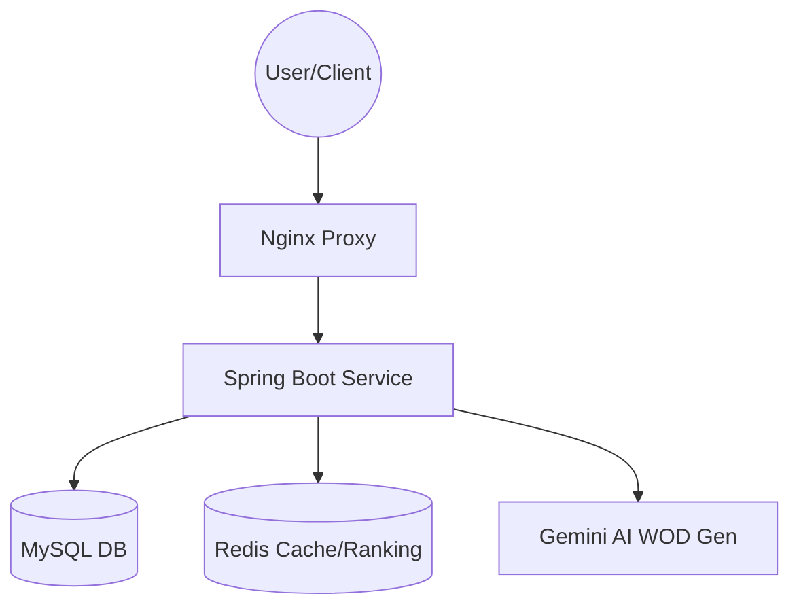

# Crossfit Platform

크로스핏 박스 관리, 오늘의 운동(WOD) 공유, 그리고 실시간 기록 랭킹 서비스를 제공하는 통합 플랫폼입니다.

## 🚀 기술 스택

### Backend
- **Core**: Java 21 (LTS), Spring Boot 3.2.1
- **Security**: Spring Security, JWT (Json Web Token)
- **Database**: 
  - MySQL 8.0 (Relational Database)
  - Redis (Real-time Ranking, Caching)
- **Infrastructure**: Nginx (Reverse Proxy), Docker, Docker Compose
- **Documentation**: Swagger (Springdoc OpenAPI 3.0)
- **Email**: Spring Mail (SMTP 연동)

### Frontend (App)
- **Framework**: Flutter (Dart)
- **State Management**: Provider
- **Networking**: Dio
- **Visualization**: fl_chart (운동 기록 및 랭킹 변화 시각화)

---

## 🏗️ 아키텍쳐 (Architecture)

본 프로젝트는 **DDD (Domain-Driven Design)** 원칙을 준수하여 도메인별 패키지 구조를 가집니다.



### 핵심 레이어
- **Domain Layer**: 비즈니스 로직과 엔티티 정의 (`com.beaverdeveloper.site.crossfitplatform.domain`)
- **Global Layer**: 공통 설정, 보안, 예외 처리 (`com.beaverdeveloper.site.crossfitplatform.global`)

---

## 🔑 핵심 기능 (Key Features)

1. **실시간 랭킹 시스템**: Redis Sorted Set을 활용하여 글로벌 및 박스별 순위를 실시간으로 집계합니다.
2. **AI WOD 생성**: Google Gemini API를 이용해 사용자 맞춤형 운동 프로그램을 제안합니다.
3. **데이터 시각화**: `fl_chart`를 통해 개인 기록 추이를 그래프로 제공하여 직관적인 성과 확인이 가능합니다.
4. **리버시 프록시 & SSL**: Nginx를 통해 보안성을 강화하고 멀티 도메인 환경에 대응합니다.

---

## 🛠️ 시작하기 (Getting Started)

### 사전 요구사항
- Docker & Docker Compose 설치

### 서버 실행 (Backend)
```powershell
# 프로젝트 루트에서 실행
docker-compose up --build
```

### 프론트엔드 실행 (Flutter)
```powershell
cd app
flutter run -d chrome
```

---

## 📄 라이선스
Copyright © 2026 Beaver Developer. All rights reserved.
